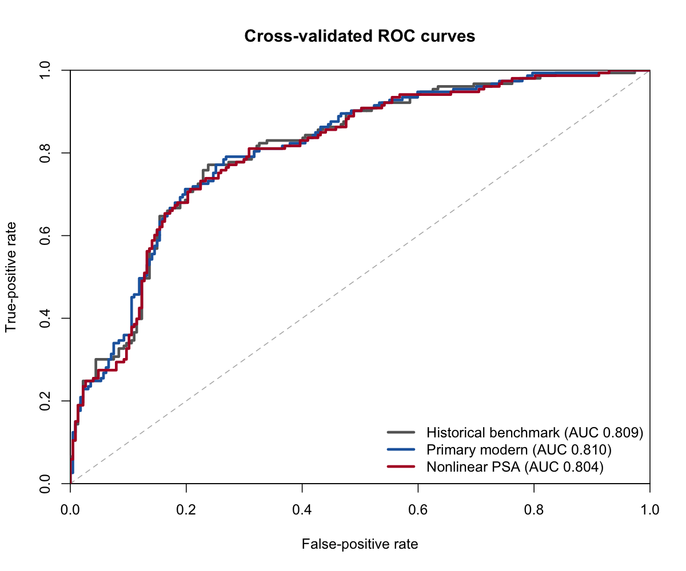
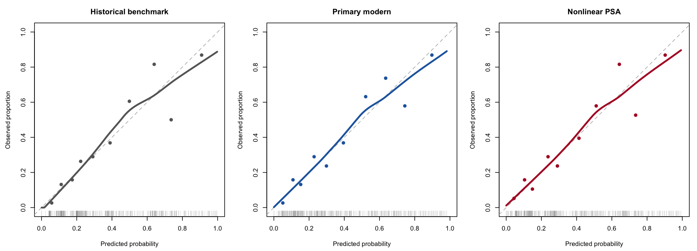
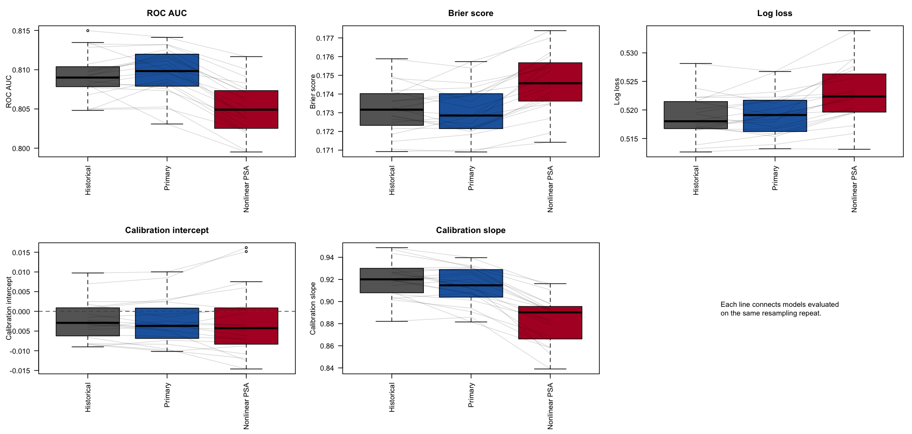
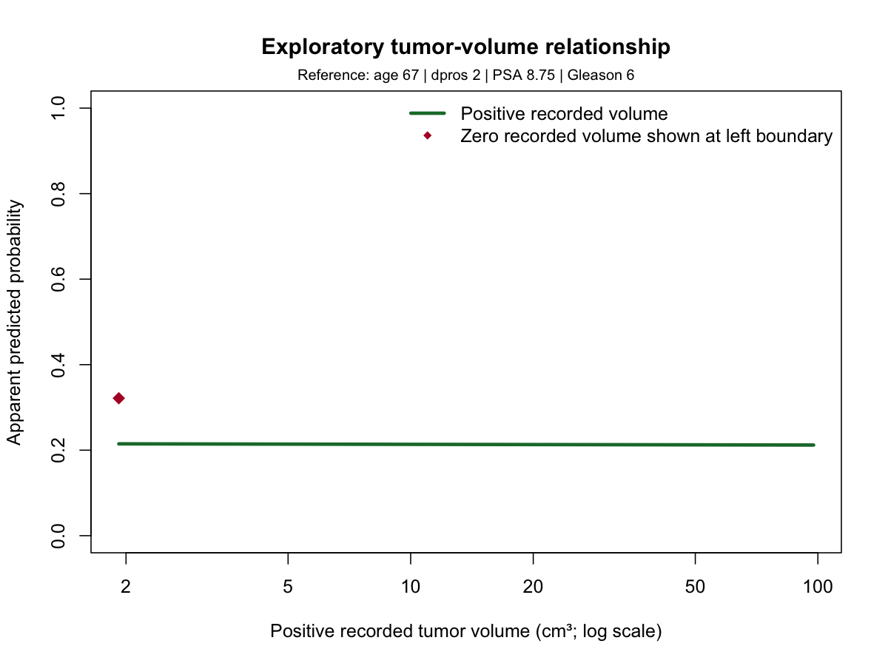

::: {.callout-warning}
This project is intended for statistical education and methodological
demonstration. It is not a medical device and must not be used to make
clinical decisions.
:::

## Abstract {.unnumbered}

<!--
Draft a 250–300 word structured summary covering background, objective,
methods, principal numerical results, and conclusion.
-->

# Introduction

## Prostatic capsule penetration

<!--
Explain the outcome and why prediction from baseline measurements is of
statistical interest. State clearly that all patients already have prostate
cancer and that this is not a screening or initial-diagnosis study.
-->

## Historical project

<!--
Introduce the 2018 STAT 696 analysis, its research objective, and its reported
final logistic regression model.
-->

## Motivation for a modern extension

<!--
Constructively explain the need for reproducibility, internal validation,
calibration assessment, and model-stability evaluation.
-->

## Research questions and objectives

<!--
Present the central research question, the dcaps sensitivity question, the
exploratory tumor-volume question, and the reproduction and validation
objectives.
-->

# Data

## Source and provenance

<!--
Summarize the Prostate Cancer Study dataset, Hosmer and Lemeshow, lbreg::PCS,
and the verified relationship between the canonical and SDSU files.
-->

## Outcome and predictors

<!--
Table 1A: compact variable, meaning, and analytical-role table.
-->

## Analysis populations

<!--
Table 1B: 380 canonical observations, 377 historical complete cases,
380 primary modern observations, and 378 zero-Gleason sensitivity records.
-->

## Data limitations

<!--
Describe the three missing race values, two zero Gleason scores, 167 zero
tumor-volume values, limited race coding, and confidentiality modification.
-->

# Historical Reproduction

## Reproduction approach

<!--
Summarize the historical workflow. Link to historical-reproduction-plan.md
rather than duplicating its technical specification.
-->

## Reproduced results

<!--
Summarize the reproduced dataset, descriptive, univariate, coefficient,
confidence-interval, odds-ratio, and AIC results.
-->

## Corrected and ambiguous findings

<!--
Discuss the corrected dpros=2 p-value and the difference between the
stepAIC-selected interaction model and the reported final model.
-->

## Historical diagnostic findings

<!--
Explain diagnostic screening, why flags do not mandate deletion, and the
role of the conservative combined-removal stress test.
-->

<!--
Table 2: historical reproduction classifications.
Source: historical-reproduction-findings.md and results/historical/.
-->

# Modern Methods

## Prespecification and sample-size assessment

<!--
Summarize the approved protocol, timing before model fitting, Riley framework,
and model-complexity conclusions.
-->

## Predictor specification

<!--
Explain age, categorical dpros, log2(PSA), continuous Gleason, exclusion of
race, and the separate roles of dcaps and tumor volume.
-->

## Models

### Historical benchmark

```r
capsule ~ factor(dpros) + psa + gleason
```

### Primary modern model

```r
capsule ~ age + factor(dpros) + log2(psa) + gleason
```

### Nonlinear PSA model

```r
capsule ~ age +
  factor(dpros) +
  splines::ns(log2(psa), df = 3) +
  gleason
```

<!--
Table 3: prespecified model definitions and parameter counts.
-->

## Internal validation

<!--
Describe the stratified 10-fold cross-validation repeated 20 times, identical
folds, out-of-fold prediction, leakage controls, and absence of a one-time
test split.
-->

## Performance measures

<!--
Define ROC AUC, Brier score, log loss, calibration intercept, and calibration
slope. Clarify that repeat percentiles are not formal confidence intervals.
-->

## Sensitivity and exploratory analyses

<!--
Summarize the dcaps, zero-Gleason, and two-part tumor-volume analyses.
-->

# Modern Results

## Validation and computational checks

<!--
Report input-check counts, prediction counts, convergence, deterministic
reruns, and adherence to the prespecified model set.
-->

## Primary model comparison

<!--
Table 4: central cross-validated performance table.
Source: ../results/modern/performance_summary.csv
-->

{#fig-roc}

## Calibration and overfitting

<!--
Interpret calibration intercepts, slopes, and local uncertainty.
-->

{#fig-calibration}

## Model stability

<!--
Compare repeat-level performance and individual prediction variability.
-->

{#fig-paired-performance}

## Primary-model coefficients

<!--
Provide a compact coefficient and odds-ratio table. Keep full-data coefficient
interpretations secondary to cross-validated performance.
-->

## Sensitivity and exploratory results

<!--
Table 5: dcaps, zero-Gleason, and tumor-volume conclusions.
Keep the detailed volume curve in supplementary material.
-->

# Discussion

## Principal findings

<!--
Lead with the equivalence of the historical and primary models, lack of
benefit from nonlinear PSA, and evidence of modest overfitting.
-->

## Relationship to the 2018 conclusions

<!--
Explain what was confirmed, corrected, clarified, and extended.
-->

## Parsimony and model complexity

<!--
Discuss the small dataset, added variance from complexity, calibration slopes,
and prediction instability.
-->

## Interpretation of PSA

<!--
Contrast raw PSA, the doubling-based log2 interpretation, and the unsupported
nonlinear extension.
-->

## Sensitivity findings

<!--
Integrate the dcaps, zero-Gleason, and volume findings without repeating the
full results section.
-->

## Implications

<!--
Discuss reproducibility, internal validation, and why complexity is not
automatically beneficial.
-->

# Limitations

<!--
Consolidate sample size, historical setting, confidentiality modification,
demographic limitations, zero-volume uncertainty, lack of external
validation, correlated resampling estimates, prediction instability, and
absence of clinical-utility evaluation.
-->

# Reproducibility and Transparency

<!--
Summarize public acquisition, renv, validation, fixed seed, saved assignments,
machine-readable outputs, deterministic reruns, prespecification, and absence
of material deviations.

Table 6: reproducibility map from scripts to outputs.
-->

# Conclusions

<!--
State the historical reproducibility, corrected and ambiguous findings,
cross-validated AUC near 0.81, lack of improvement from added complexity,
preference for parsimony, and need for external validation.
-->

# References {.unnumbered}

<!--
Include Hosmer and Lemeshow; Hedayati (2018); TRIPOD+AI; PROBAST+AI; Riley
and colleagues; and any additional methods cited in the final narrative.
-->

# Supplementary Material {.unnumbered}

<!--
Keep this section minimal. Include or link full coefficients, repeat-level
ranges, sensitivity details, and the exploratory volume figure.
-->

## Technical documentation

- [Historical reproduction plan](historical-reproduction-plan.md)
- [Historical reproduction findings](historical-reproduction-findings.md)
- [Modern analysis plan](modern-analysis-plan.md)
- [Sample-size and model-complexity assessment](sample-size-assessment.md)
- [Modern analysis findings](modern-analysis-findings.md)

## Exploratory tumor-volume figure

{#fig-volume}
